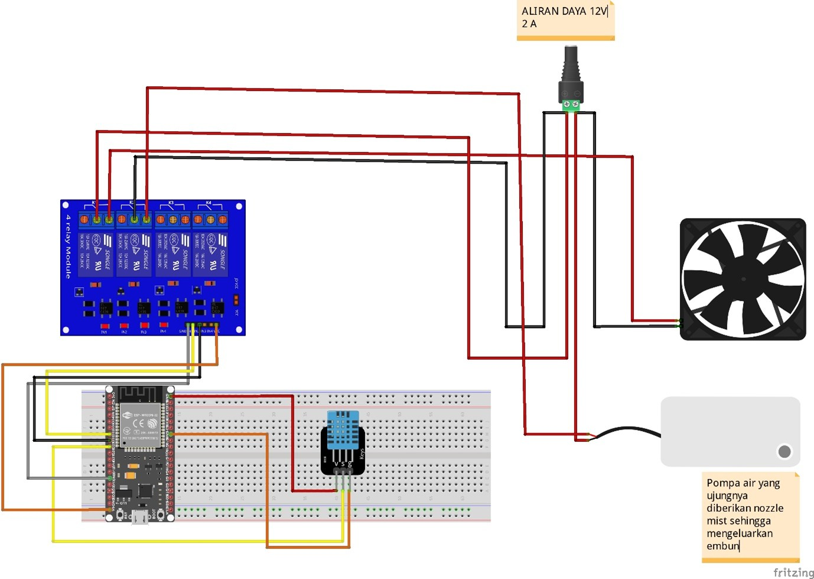
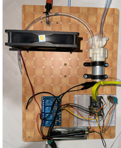
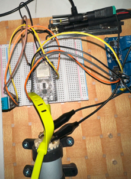
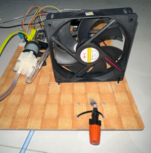
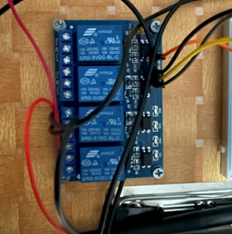

# PROYEK IOT: Kipas Angin dan Misting Otomatis Menggunakan NodeMCU ESP-32 dan Sensor Suhu DHT11

## Deskripsi Proyek

Proyek ini merupakan sistem otomatisasi kipas angin dan misting berbasis IoT yang menggunakan NodeMCU ESP-32 sebagai mikrokontroler dan sensor suhu DHT11 untuk mendeteksi suhu lingkungan. Sistem ini akan mengaktifkan kipas angin dan pompa misting secara otomatis berdasarkan suhu yang terdeteksi.

## Komponen yang Digunakan

- NodeMCU ESP-32
- Sensor Suhu DHT11
- Relay 4 Channel
- Kipas Angin DC 12V
- Pompa Air DC 12V
- Breadboard & Kabel Jumper
- Power Supply 12V 2A

## Diagram Rangkaian

## Dokumentasi Foto Proyek

  

  

  

  

## Video

[Percobaan Alat Dapat Kamu Lihat Disini](https://www.youtube.com/watch?v=CrBMEwiue_U)

## Cara Kerja

1. Sensor DHT11 membaca suhu lingkungan.
2. NodeMCU ESP-32 memproses data suhu.
3. Jika suhu melebihi batas tertentu, NodeMCU mengaktifkan relay untuk menyalakan kipas angin dan pompa misting.
4. Kipas angin dan misting akan otomatis mati jika suhu turun di bawah ambang batas.

## Instalasi & Penggunaan

1. Rangkai semua komponen sesuai diagram.
2. Upload program ke NodeMCU ESP-32.
3. Hubungkan power supply.
4. Sistem akan berjalan otomatis sesuai logika yang telah diprogram.

## Lisensi

Proyek ini bersifat open source dan dapat digunakan untuk keperluan edukasi.

